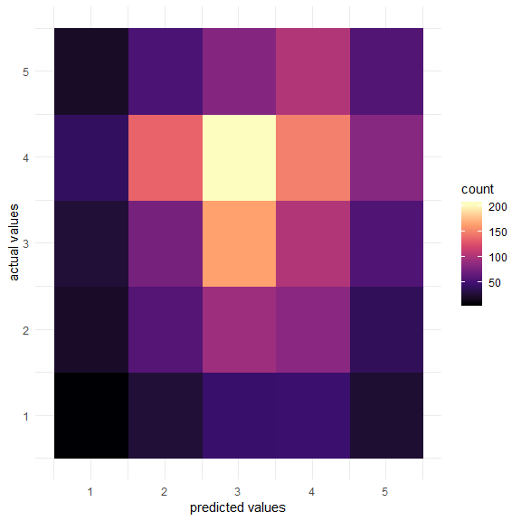
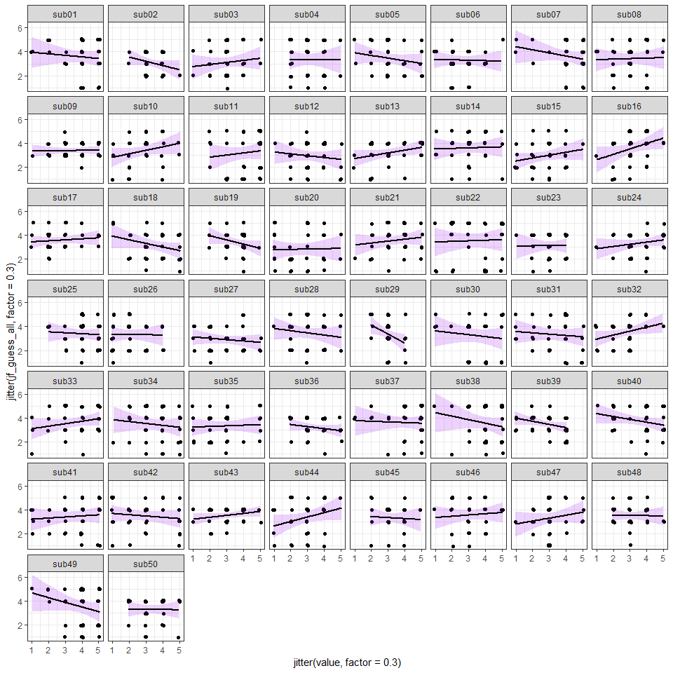

In clinical settings as well as experimental research, there is often a need to assess participents in a number of different dimensions using standard neuropsychological assment tools and self-report measures. However, due to time constraints and other issues, it is not feasable to collect every possible measure of interest for every participent in a given study. That said, if you have collected at least one reliable assesment, it may be possible to approximate item responses in another set of assessments using tools of natural language processing. 

The code below attempts a rudimentary approach to meeting this challenge. Here, we attempt to use the average distance between word vectors in a phrase to imputate an assessment score for an "unassesssed" questionarre. We the compare the predicted responses from this data to actual responses from a set of real subjects.   

**Spoiler alert:** It doesn't work as implimented here. However, it provides food for thought and an avenune for a more refined approach to this question going forward.  

```r
library(tidyverse)
library(text2vec)
library(stringr)
library(lme4)
library(lmerTest)
library(reshape2)
library(caret)


setwd("C:/Users/rober/Documents/MIND_2018/")

wiki <- readLines("C:/Users/rober/Documents/MIND_2018/survey_words_again.txt", n = 1, warn = FALSE)
```

## Load data and tokenize

```r
# Create iterator over tokens
tokens = space_tokenizer(wiki)

# Create vocabulary. Terms will be unigrams (simple words).
it <- itoken(tokens, progressbar = FALSE)
vocab <-  create_vocabulary(it)

# Use our filtered vocabulary
vectorizer <-  vocab_vectorizer(vocab)

# use window of 5 for context words
tcm <-  create_tcm(it, vectorizer, skip_grams_window = 5L)
```


```r
glove <-  GlobalVectors$new(word_vectors_size = 300, vocabulary = vocab, x_max = 10)

set.seed(5)
wv_main <-  glove$fit_transform(tcm, n_iter = 10, convergence_tol = 0.005)
```

```
## INFO [2018-08-07 14:30:09] 2018-08-07 14:30:09 - epoch 1, expected cost 0.1673
## INFO [2018-08-07 14:30:09] 2018-08-07 14:30:09 - epoch 2, expected cost 0.1364
## INFO [2018-08-07 14:30:10] 2018-08-07 14:30:10 - epoch 3, expected cost 0.1701
## INFO [2018-08-07 14:30:10] Success: early stopping. Improvement at iterartion 3 is less then convergence_tol
```


```r
wv_context <-  glove$components
dim(wv_context)
```

```
## [1] 300 368
```

```r
word_vectors <-  wv_main + t(wv_context)
```

## Define helper function to compare questions

```r
q2vec <- function(question1, question2, method="pearson"){
  
  # question 1  
  q1_split <- as.character(str_split(string = question1, pattern = " ", simplify = TRUE))

  q1_mat <- vector()
  for(word in q1_split){
    vals <- word_vectors[word, , drop=TRUE]
    q1_mat <- cbind(q1_mat, vals, deparse.level = 0)
  }
  
  q1_vec <- apply(q1_mat,1, mean)
  

  # quesiton 2
  q2_split <- as.character(str_split(string = question2, pattern = " ", simplify = TRUE))
  
  q2_mat <- vector()
  for(word in q2_split){
    vals <- word_vectors[word, , drop=TRUE]
    q2_mat <- cbind(q2_mat, vals, deparse.level = 0)
  }
  
  q2_vec <- apply(q2_mat,1, mean)
  
  # relate question vectors
  r <- cor(q1_vec, q2_vec, method = method)
  all <- data.frame(question1, question2, r)
  
  return(all)
  
}

bfas_q <- read_lines("bfas_questions.txt")
jf_q <- read_lines("jf_questions.txt")


df <- data.frame()

for(bfas in bfas_q){
  
  for(jf in jf_q){
    
    temp <- q2vec(bfas, jf, method = "spearman")
    
    df <- rbind(df, temp)
    
  }
  
}

# write.csv(df, "bfas_jf_question_vecs.csv")
```

## Find the best questions per survey to map scores.

```r
filter_df <- data.frame()

for(jf in unique(df$question2)){
  
  cmd <- paste0("df %>% filter(question2 == '", jf ,"') %>% filter(r == max(r))" )
  
  tmp_df <- eval(parse(text = cmd))
  
  filter_df <- rbind(filter_df, tmp_df)
  
}

filter_df$question1 <- as.character(filter_df$question1)
filter_df$question2 <- as.character(filter_df$question2)
```

## Load personality data

```r
pers_bfas <- read.csv("fyself_personality_transp_bfas.csv", stringsAsFactors = FALSE, header = T)
#pers_bfas[,2:51] <- apply(pers_bfas[,2:51], 2, scale) 

pers_jf <- read.csv("fyself_personality_transp_jf.csv", stringsAsFactors = FALSE, header = T)
#pers_jf[,2:15] <- apply(pers_jf[,2:51], 2, scale) 


filter_jf_guess <- inner_join(pers_jf, filter_df)
```

```
## Joining, by = "question2"
```
## Attach personality data to predictions

```r
jf_guess_all <- vector()
jf_guess <- vector()
n <- 0
for(k in 2:51){
  for(q in 1:length(pers_bfas$question1)){
  
    for(i in 1:length(filter_df$question1))

    if(pers_bfas[q,1] == filter_df[i,1]){
      n <- n + 1
      jf_guess[n] <-  pers_bfas[q,k]
    }
  }
}
```

## Fit to data and plot results
Below we can see the confusion matrix of the model 

```r
## fit to data

melt_jf_pers <- melt(pers_jf[,2:51])
```

```
## No id variables; using all as measure variables
```

```r
melt_jf_pers$jf_guess_all <- jf_guess
melt_jf_pers$r <- rep(filter_df$r,50)
melt_jf_pers$sub <- mapply(rep,1:50,36) %>% as.vector() 

table <- table(melt_jf_pers$value,melt_jf_pers$jf_guess_all)

table_m <- melt(table)
ggplot(table_m, aes(Var1, Var2, fill=value)) +
  geom_raster() +
  scale_fill_viridis_c(option = "magma", name ="count") +
  labs(x = "predicted values", y = "actual values") + 
  theme_minimal()
```

<!-- -->

```r
chisq.test(table)
```

```
## 
## 	Pearson's Chi-squared test
## 
## data:  table
## X-squared = 26.289, df = 16, p-value = 0.05009
```

```r
confusionMatrix(table)
```

```
## Confusion Matrix and Statistics
## 
##    
##       1   2   3   4   5
##   1   8  21  27  41  20
##   2  27  58  75 136  54
##   3  45  93 165 203  82
##   4  46  85 103 149 103
##   5  24  39  56  83  57
## 
## Overall Statistics
##                                           
##                Accuracy : 0.2428          
##                  95% CI : (0.2231, 0.2633)
##     No Information Rate : 0.34            
##     P-Value [Acc > NIR] : 1               
##                                           
##                   Kappa : 0.0143          
##  Mcnemar's Test P-Value : 1.69e-09        
## 
## Statistics by Class:
## 
##                      Class: 1 Class: 2 Class: 3 Class: 4 Class: 5
## Sensitivity          0.053333  0.19595  0.38732  0.24346  0.18038
## Specificity          0.933939  0.80585  0.69214  0.71633  0.86388
## Pos Pred Value       0.068376  0.16571  0.28061  0.30658  0.22008
## Neg Pred Value       0.915627  0.83586  0.78465  0.64764  0.83193
## Prevalence           0.083333  0.16444  0.23667  0.34000  0.17556
## Detection Rate       0.004444  0.03222  0.09167  0.08278  0.03167
## Detection Prevalence 0.065000  0.19444  0.32667  0.27000  0.14389
## Balanced Accuracy    0.493636  0.50090  0.53973  0.47990  0.52213
```


The plot below breaks it down for each subject to plot the relationship in each subject (keeping in mind that modeling this is continuous data probably isn't the best thing to do here.)

```r
# facet plot per subject
ggplot(melt_jf_pers,aes(jitter(value, factor = .3), jitter(jf_guess_all,factor = .3))) +
  geom_point() +
  geom_smooth(method = 'lm', color = 'black', fill="purple", alpha = .2) +
  facet_wrap(~variable) +
  theme_bw()
```

<!-- -->

## Fit linear models

```r
cor.test(melt_jf_pers$value, melt_jf_pers$jf_guess_all)
```

```
## 
## 	Pearson's product-moment correlation
## 
## data:  melt_jf_pers$value and melt_jf_pers$jf_guess_all
## t = 0.47636, df = 1798, p-value = 0.6339
## alternative hypothesis: true correlation is not equal to 0
## 95 percent confidence interval:
##  -0.03498722  0.05740599
## sample estimates:
##        cor 
## 0.01123336
```

```r
fit <- lmer(value ~ jf_guess_all + (1 + jf_guess_all|variable), REML = FALSE, data = melt_jf_pers)
summary(fit)
```

```
## Linear mixed model fit by maximum likelihood . t-tests use
##   Satterthwaite's method [lmerModLmerTest]
## Formula: value ~ jf_guess_all + (1 + jf_guess_all | variable)
##    Data: melt_jf_pers
## 
##      AIC      BIC   logLik deviance df.resid 
##   5375.0   5408.0  -2681.5   5363.0     1794 
## 
## Scaled residuals: 
##      Min       1Q   Median       3Q      Max 
## -2.75633 -0.70679 -0.03901  0.73770  2.22846 
## 
## Random effects:
##  Groups   Name         Variance Std.Dev. Corr 
##  variable (Intercept)  0.293712 0.54195       
##           jf_guess_all 0.002251 0.04745  -1.00
##  Residual              1.096652 1.04721       
## Number of obs: 1800, groups:  variable, 50
## 
## Fixed effects:
##                Estimate Std. Error         df t value Pr(>|t|)    
## (Intercept)   3.236e+00  1.073e-01  6.086e+01  30.159   <2e-16 ***
## jf_guess_all -4.642e-05  2.212e-02  2.279e+02  -0.002    0.998    
## ---
## Signif. codes:  0 '***' 0.001 '**' 0.01 '*' 0.05 '.' 0.1 ' ' 1
## 
## Correlation of Fixed Effects:
##             (Intr)
## jf_guess_ll -0.846
```


